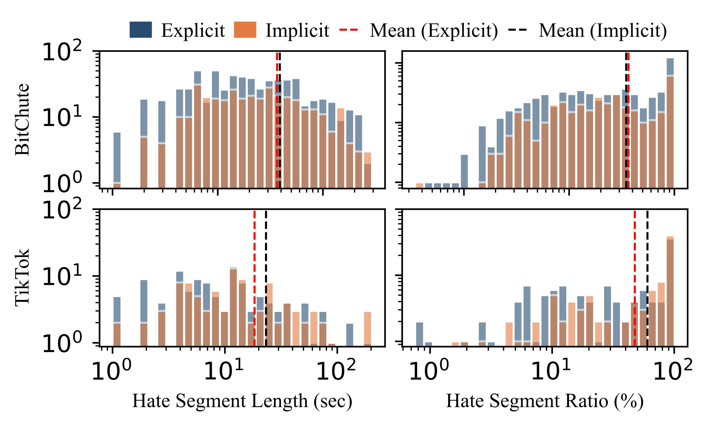

# $DeHate$: A Holistic Hateful Video Dataset


## ⚠️ Ethics Statement

**This repository contains sensitive content that may be disturbing to some readers.**


The videos and data provided for annotation in this project have been sourced from publicly accessible social media platforms in compliance with all applicable laws and regulations. 

The content within these videos does not reflect the opinions, beliefs, or viewpoints of the research group or its members.

This dataset is intended solely for research purposes and must be treated with strict confidentiality. Annotators are prohibited from downloading, saving, or disseminating any part of the data in any form. Any breach of this policy will be considered a violation of project terms and may result in legal consequences. No personally identifiable information is included, and all procedures align with relevant legal and ethical standards.

---
**This is the official repository for the ACM Multimedia 2025 submission “DeHate: A Holistic Hateful Video Dataset for Explicit and Implicit Hate Detection.”**

**DeHATE** is a large-scale multimodal dataset for the detection of explicit and implicit hate in short-form videos. The dataset comprises over 6,689 annotated videos collected from TikTok and BitChute, spanning six social groups, with fine-grained segment-level labels.

This repository contains:
- The cleaned annotation data in `.xlsx` format.
- Documentation and statistics on label distributions, hate segment, contributing modality, and target groups.

---

## Dataset Summary

DeHATE includes:
- Videos from two platforms: TikTok (highly regulated) and BitChute (loosely moderated)
- Annotation of both explicit and implicit hate
- Segment-level localization (timestamps for hateful content)
- Modality labels (text, audio, visual)
- Six target groups: Race, Gender, Religion, Sexual Orientation, Disability, Immigration

---

## Data Statistics

### Dataset Overview

**Label distribution of DeHATE.**

| Platform  | Hate (Explicit) | Hate (Implicit) | Non-Hate |
|-----------|:--------------:|:---------------:|:--------:|
| BitChute  | 1055           | 835             | 3162     |
| TikTok    | 115            | 115             | 1407     |
| **Total** | 1170           | 950             | 4569     |

---

### Segment and Temporal Analysis

**Hate Segment Length and Proportion Distributions**



> The distributions of hate segment lengths (in seconds) and proportions (%) in videos for each platform and hate type (explicit, implicit), with x- and y-axes in log scale and mean values marked by vertical dashed lines.

---

**Normalized Starting Time Distribution of Hate Segments**


> The density-normalized starting times of hate segments by platform and video length, comparing explicit and implicit types.

---

### Modality Analysis

**Distribution of contributing modalities (Top 3 in bold).**

| Modality                   | BitChute | TikTok |
|----------------------------|:--------:|:------:|
| **Text only**              | 951      | 23     |
| Visual only                | 9        | 15     |
| Audio only                 | 207      | 66     |
| Visual + Audio             | 257      | 92     |
| Visual + Text              | 26       | 2      |
| Text + Audio               | 82       | 3      |
| **Visual + Audio + Text**  | 358      | 29     |

---

**Modality Composition of Explicit and Implicit Hate**


> The modality composition for explicit and implicit hate in the dataset.

---

### Target Group Distribution

**Distribution of hateful videos by single and multiple target groups (Top 3 single targets in bold).**

| Target Group(s)                | BitChute | TikTok |
|--------------------------------|:--------:|:------:|
| **Single Target Group**        |          |        |
| **Race**                       | 573      | 71     |
| **Gender**                     | 289      | 16     |
| Religion                       | 71       | 28     |
| Sexual Orientation             | 203      | 19     |
| Disability                     | 23       | 31     |
| Immigration                    | 318      | 33     |
| **Top 5 Multiple Target Groups**|         |        |
| Race + Immigration             | 134      | 14     |
| Race + Religion                | 61       | 6      |
| Race + Gender                  | 59       | 2      |
| Gender + Sexual Orientation    | 46       | 4      |
| Race + Sexual Orientation      | 38       | –      |
| Race + Religion + Immigration  | –        | 2      |

---

**Proportion of Hateful Videos by Target Group**


> The proportion of hateful videos by targeted group, separated into explicit and implicit hate.

---

### Textual Modality Analysis

**Sentiment Scores and Top Keywords in Textual Content**


> The sentiment scores of textual content across explicit hate, implicit hate, and non-hate categories for BitChute and TikTok (left). The top 10 keywords for each category: explicit, implicit, non-Hate (right).

---

### Audio Modality Analysis

#### Audio Zero Crossing Rate and Emotion

**(a) Zero Crossing Rate (ZCR) for Explicit, Implicit, and Non-Hate Content**


> The Zero Crossing Rate (ZCR) of the audio signal over time for explicit hate, implicit hate, and non-hate content, respectively.

---

**(b) Audio Emotion Heatmap**


> The distribution of detected emotions in the audio across different content types, with columns representing emotions and rows representing explicit, implicit, and non-hate categories.

---

### Visual Modality Analysis

**Object Detection and Word Cloud for Explicit and Implicit Hate Content**


> The detected object categories (word clouds) and example video frames with object detection results for explicit hate (left) and implicit hate (right) content.

---

## Benchmark Results

Below we report the performance of several unimodal and multimodal baselines evaluated on the DeHATE dataset.

**Binary (Hate vs. Non-Hate) Results**
| Model           |  Accuracy |  Macro F1 |   F1(H)   |   Pre(H)  |   Rec(H)  |
| --------------- | :-------: | :-------: | :-------: | :-------: | :-------: |
| Bert            |   0.560   |   0.558   |   0.529   |   0.399   | **0.783** |
| RoBERTa         | **0.744** | **0.699** | **0.583** | **0.600** |   0.567   |
| OpenAI\_TextEmb | **0.758** | **0.708** | **0.586** | **0.636** |   0.544   |
| MFCC            |   0.551   |   0.528   |   0.425   |   0.525   |   0.357   |
| VGGish          |   0.528   |   0.528   |   0.522   |   0.384   | **0.818** |
| Whisper         |   0.679   |   0.595   |   0.410   |   0.489   |   0.353   |
| ViT             |   0.649   |   0.587   |   0.427   |   0.414   |   0.441   |
| ViViT           |   0.612   |   0.600   |   0.518   |   0.428   |   0.657   |
| Timesformer     |   0.661   |   0.611   |   0.471   |   0.463   |   0.478   |
| T1+A2+V1        |   0.620   |   0.610   |   0.545   |   0.438   |   0.720   |
| T2+A1+V2        |   0.689   |   0.630   |   0.481   |   0.456   |   0.509   |
| GPT4-o          |   0.523   |   0.521   |   0.493   |   0.371   |   0.733   |

**Multiclass (Explicit, Implicit, Non-Hate) Results**
| Model           |  Accuracy |  Macro F1 |   F1(E)   |   Pre(E)  |   Rec(E)  |   F1(I)   |   Pre(I)  |   Rec(I)  |
| --------------- | :-------: | :-------: | :-------: | :-------: | :-------: | :-------: | :-------: | :-------: |
| Bert            |   0.492   |   0.400   |   0.306   |   0.281   |   0.335   |   0.251   |   0.181   | **0.397** |
| RoBERTa         | **0.683** |   0.488   |   0.427   | **0.402** |   0.455   |   0.221   | **0.370** |   0.158   |
| OpenAI\_TextEmb | **0.702** | **0.529** | **0.477** | **0.469** | **0.485** | **0.277** |   0.333   |   0.237   |
| MFCC            |   0.660   |   0.288   |   0.068   |   0.043   |   0.169   |   0.000   |   0.000   |   0.000   |
| VGGish          |   0.507   |   0.408   |   0.293   |   0.228   |   0.409   | **0.269** |   0.236   |   0.312   |
| Whisper         |   0.657   |   0.391   |   0.264   |   0.336   |   0.217   |   0.117   |   0.286   |   0.074   |
| ViT             |   0.608   |   0.416   |   0.270   |   0.268   |   0.273   |   0.214   |   0.195   |   0.237   |
| ViViT           |   0.575   |   0.401   |   0.207   |   0.236   |   0.185   |   0.259   |   0.223   |   0.309   |
| Timesformer     |   0.569   |   0.399   |   0.287   |   0.246   |   0.347   |   0.181   |   0.220   |   0.347   |
| T1+A2+V1        |   0.617   |   0.431   |   0.281   |   0.292   |   0.270   |   0.242   |   0.255   |   0.255   |
| T2+A1+V2        |   0.603   |   0.411   |   0.305   |   0.302   |   0.307   |   0.174   |   0.158   |   0.158   |
| GPT4-o          |   0.548   | **0.534** |   0.454   |   0.367   | **0.593** |   0.202   | **0.364** | **0.364** |

---

## File List

- `DeHate.xlsx` — Main data file with video-level and segment-level annotations.
- `get_bitchute_video.py` — A Python script to download BitChute videos with `video_ids`.
---

## Accessing Videos


Due to copyright and platform restrictions, we’re unable to share the original video files directly. or the public version of the DeHATE dataset, we provide only the video IDs, which can be used to identify and retrieve the videos from TikTok and BitChute.
To download videos from BitChute, you can use the `get_bitchute_video.py` script. For TikTok, please use the official TikTok API, available at [https://developers.tiktok.com/](https://developers.tiktok.com/).
Please note that some videos may be removed by the platforms for violating content policies. If you have trouble accessing certain videos or need help, feel free to contact [yuchen.zhang@essex.ac.uk](mailto:yuchen.zhang@essex.ac.uk) for support.

Run the following script:

```python get_bitchute_video.py --video_id abc123 --output_dir ./downloads/ ```

This will download the video from https://www.bitchute.com/video/abc123/ and save it into the downloads/ folder with a filename like:

```{Publisher}_{Publish_Date}_{Video_Title}.mp4 ```


